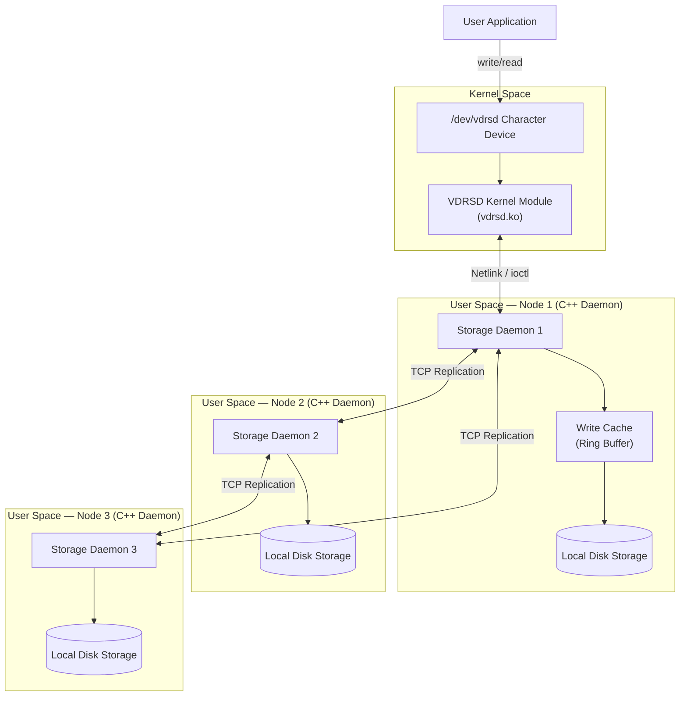
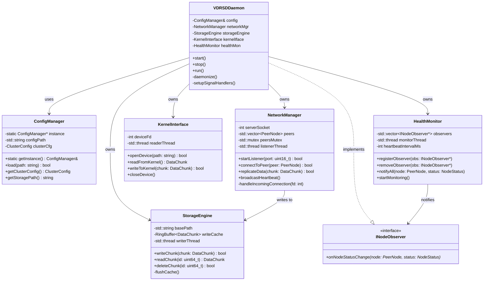
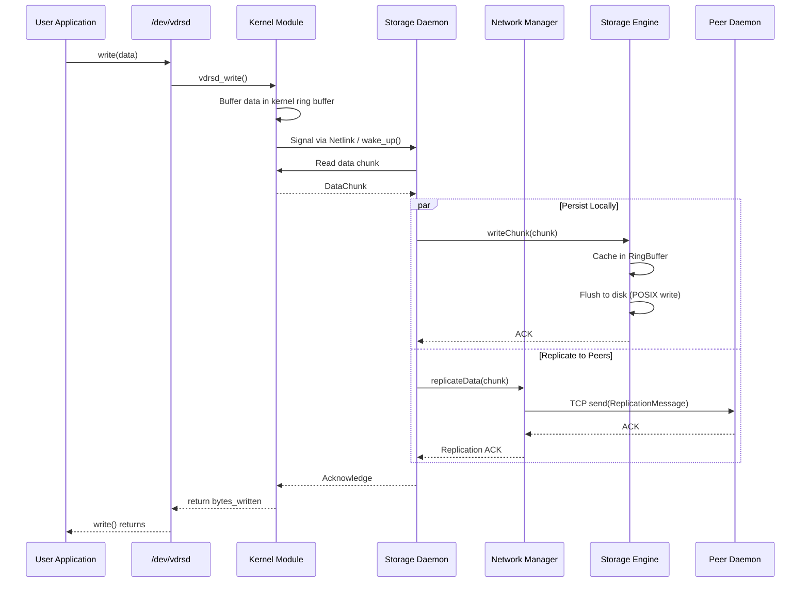
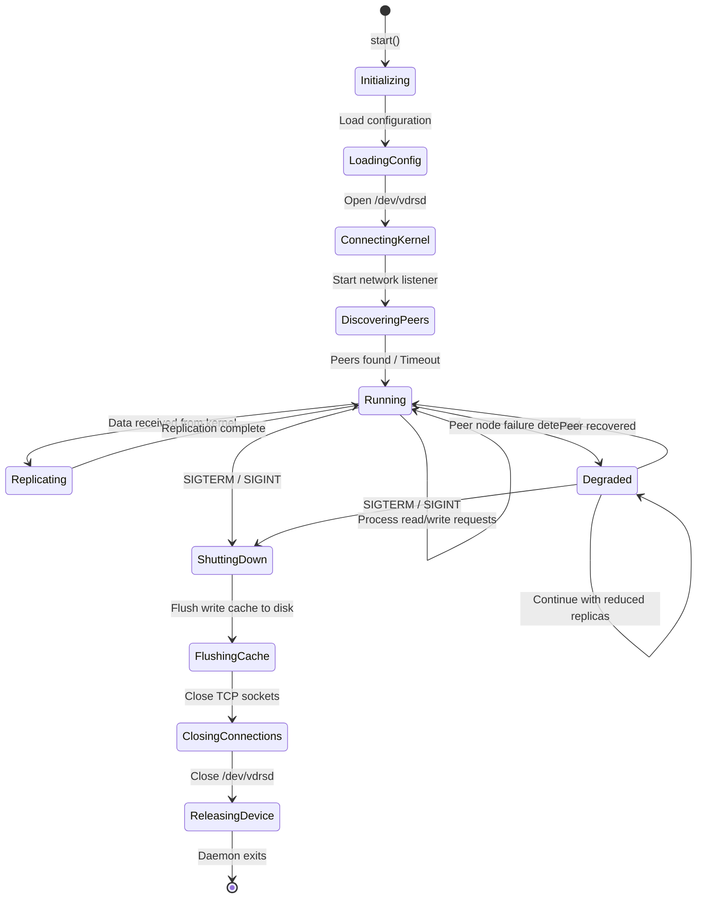
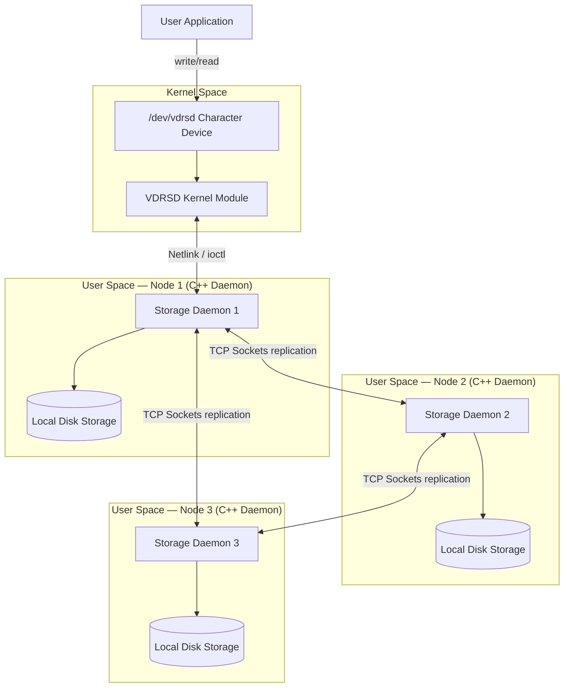
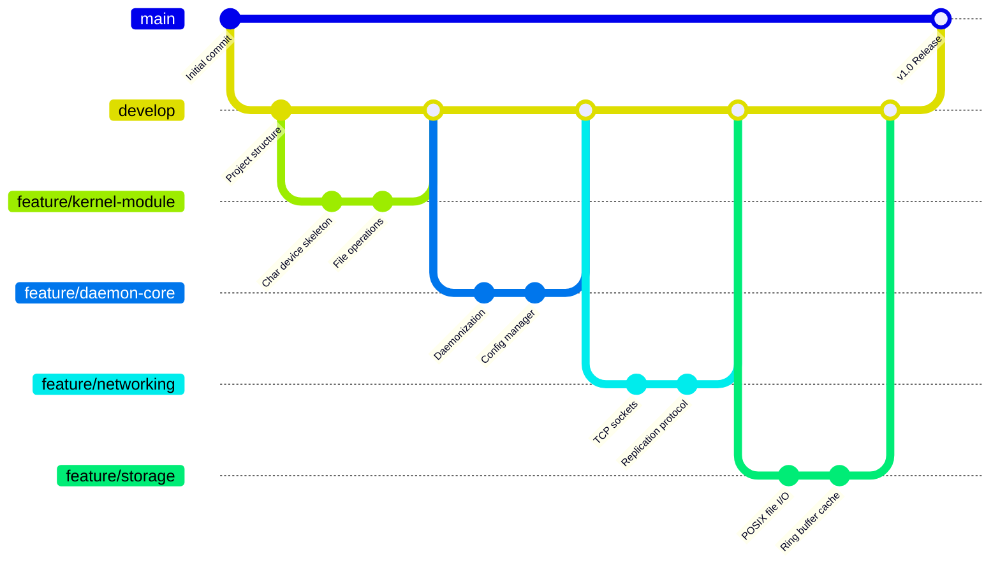
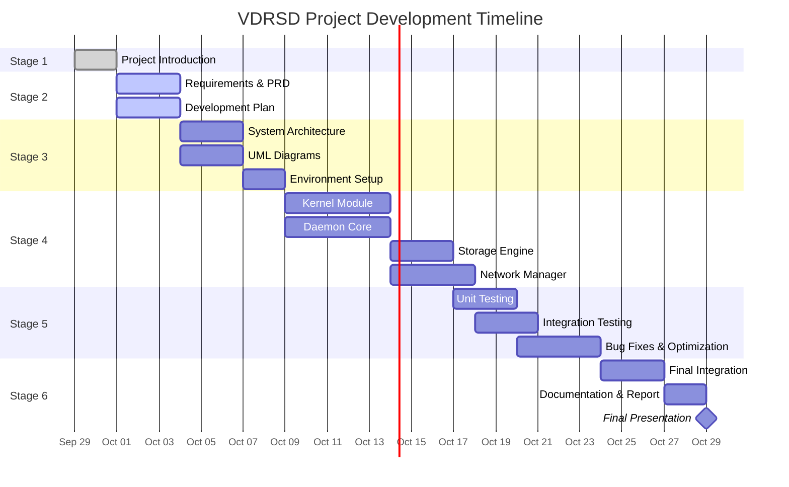

# Capstone Project: Virtual Distributed Replicated Storage Device (VDRSD)

> **Individual Project — Linux Device Drivers, System Programming & C++**
>
> A fault-tolerant, distributed storage system where data written to a virtual character device is automatically replicated across multiple network nodes. Built to demonstrate a professional software development lifecycle from requirements → design → implementation → testing → final delivery.

---

## Table of Contents

- [Project Overview](#project-overview)
- [Mapping to Training Modules](#mapping-to-training-modules)
- [Project Development Stages](#project-development-stages)
  - [Stage 1 – Project Introduction](#stage-1--project-introduction)
  - [Stage 2 – Project Requirements & Development Plan](#stage-2--project-requirements--development-plan)
  - [Stage 3 – System Design & Architecture](#stage-3--system-design--architecture)
  - [Stage 4 – Initial Implementation & Prototype](#stage-4--initial-implementation--prototype)
  - [Stage 5 – Testing, Integration & Improvement](#stage-5--testing-integration--improvement)
  - [Stage 6 – Final Implementation & Presentation](#stage-6--final-implementation--presentation)
- [System Architecture](#system-architecture)
- [Core Components](#core-components)
- [Data Structures](#data-structures)
- [UML Diagrams](#uml-diagrams)
- [Development Environment Setup](#development-environment-setup)
- [Git Branching Strategy](#git-branching-strategy)
- [Build & Run](#build--run)
- [Project Timeline](#project-timeline)
- [Achievements, Limitations & Future Work](#achievements-limitations--future-work)
- [License](#license)

---

## Project Overview

The **Virtual Distributed Replicated Storage Device (VDRSD)** is a complex system designed to demonstrate the complete spectrum of topics covered in the Wipro Embedded Track training. It provides a fault-tolerant, distributed storage mechanism where data written to a virtual device (`/dev/vdrsd`) on one node is automatically replicated across multiple network nodes via TCP sockets.

### Problem Statement

Modern distributed systems require fault-tolerant storage that can survive individual node failures without data loss. However, building such systems requires deep integration across the Linux kernel, system-level daemons, and network communication — skills that span multiple disciplines. There is a need for a unified project that exercises Linux Device Drivers, System Programming (POSIX APIs, daemon processes, IPC), and modern C++ simultaneously.

### Expected Outcome

A fully functional distributed storage device where:
- A user writes data to `/dev/vdrsd` (character device)
- The kernel module captures the write and forwards it to a user-space daemon
- The C++ daemon replicates the data across peer nodes via TCP sockets
- Data can be read back from any replica node, providing redundancy and fault tolerance

### Application

- Educational demonstration of end-to-end Linux systems programming
- Foundation for building production-grade distributed storage (e.g., DRBD-like systems)
- Reference implementation for kernel-to-userspace communication patterns

---

## Mapping to Training Modules

| Module | Topic | Project Implementation |
| :--- | :--- | :--- |
| **Module 1 & 2** | Computer Architecture (HW/NW) | TCP/IP Socket communication between distributed nodes. Memory management for caching data before writing to disk. |
| **Module 3** | Linux OS & Git | Developed entirely on Linux, using Bash scripting for startup/shutdown, and structured as a Git repository with branching strategy. |
| **Module 4** | C++ Programming | Core daemon implemented in C++ (OOPs, STL, Multithreading, Smart Pointers, Design Patterns). |
| **Module 5** | Linux System Programming | Daemon processes, POSIX File I/O, IPC (Sockets), Signal Handling, thread synchronization (Mutex, Condition Variables). |
| **Module 6** | Linux Device Drivers | A custom Character Device Driver (`/dev/vdrsd`) that acts as the user interface to the storage system. |
| **Module 7 & 8** | Software Arch & SDLC | Implemented using SOLID principles, Layered architecture, and design patterns (Singleton, Factory, Observer). |

---

## Project Development Stages

This project is developed across **6 stages**, each with proper documentation, Git commits, version control, progress evidence, demonstration, and a clear roadmap for the next stage.

---

### Stage 1 – Project Introduction

**Objective:** Introduce the project idea, explain the problem, define scope, and describe expected outcomes.

| Item | Description |
| :--- | :--- |
| **Project Name** | Virtual Distributed Replicated Storage Device (VDRSD) |
| **Problem** | Lack of a unified educational project that exercises Linux kernel development, system-level daemon programming, network communication, and modern C++ in a single coherent system. |
| **Scope** | Build a character device driver, a multi-threaded C++ replication daemon, TCP-based peer networking, and local persistent storage — all integrated end-to-end. |
| **Expected Outcome** | A working distributed storage system demonstrating data write → kernel capture → daemon replication → persistent storage across multiple nodes. |
| **Application** | Educational tool, foundation for DRBD-like systems, reference architecture for kernel-userspace IPC. |

**Deliverables:**
- [x] Project idea finalized
- [x] Problem statement documented
- [x] Scope defined
- [x] Expected outcomes and applications explained

**Roadmap → Stage 2:** Translate the project idea into formal requirements and a development plan.

---

### Stage 2 – Project Requirements & Development Plan

**Objective:** Identify functional/non-functional requirements, prepare the PRD, and define the development timeline.

#### Functional Requirements

| ID | Requirement | Priority |
| :--- | :--- | :--- |
| FR-01 | Character device `/dev/vdrsd` accepts `open`, `read`, `write`, `release` operations | High |
| FR-02 | Kernel module buffers write data and signals the user-space daemon | High |
| FR-03 | C++ daemon runs as a background Linux daemon (fork, setsid) | High |
| FR-04 | Daemon receives data from kernel via Netlink/IOCTL/device read interface | High |
| FR-05 | Daemon replicates received data to peer nodes via TCP sockets | High |
| FR-06 | Daemon persists data to local filesystem using POSIX File I/O | High |
| FR-07 | Read requests retrieve data from local storage or replicas | Medium |
| FR-08 | Node health monitoring via heartbeat mechanism | Medium |
| FR-09 | Configurable cluster topology (add/remove nodes) | Low |
| FR-10 | Comprehensive logging (syslog for daemon, printk for kernel) | Medium |

#### Non-Functional Requirements

| ID | Requirement | Target |
| :--- | :--- | :--- |
| NFR-01 | Replication latency | < 100ms on localhost cluster |
| NFR-02 | Data consistency | Eventual consistency across replicas |
| NFR-03 | Reliability | System tolerates single-node failure |
| NFR-04 | Code quality | SOLID principles, no memory leaks (Valgrind clean) |
| NFR-05 | Portability | Linux kernel 5.x+ with GCC 11+ |
| NFR-06 | Documentation | Complete inline docs + external project report |

#### Project Modules

| Module | Description | Language |
| :--- | :--- | :--- |
| `kernel/` | Character device driver (vdrsd.ko) | C |
| `daemon/` | Storage daemon with networking and storage engine | C++ |
| `scripts/` | Startup, shutdown, and utility scripts | Bash |
| `tests/` | Unit tests, integration tests, stress tests | C++ / Bash |
| `docs/` | Architecture diagrams, UML, project report | Markdown / Draw.io |

#### Development Timeline

| Week | Stage | Key Activities |
| :--- | :--- | :--- |
| Week 1 | Stage 1–2 | Project introduction, requirements, PRD |
| Week 2 | Stage 3 | System design, architecture diagrams, UML, environment setup |
| Week 3 | Stage 4 | Core implementation — kernel module + daemon skeleton |
| Week 4 | Stage 4–5 | Networking, replication, integration |
| Week 5 | Stage 5 | Testing, debugging, performance improvement |
| Week 6 | Stage 6 | Final integration, documentation, presentation |

**Deliverables:**
- [x] Functional requirements documented
- [x] Non-functional requirements documented
- [x] Project modules identified
- [x] Development timeline prepared
- [x] PRD complete

**Roadmap → Stage 3:** Design the system architecture, create UML diagrams, and set up the development environment.

---

### Stage 3 – System Design & Architecture

**Objective:** Prepare the overall system architecture, UML diagrams, data structures, implementation plan, and development environment.

#### Overall System Architecture



#### Major System Components

| Component | Responsibility |
| :--- | :--- |
| **Kernel Module (vdrsd.ko)** | Expose `/dev/vdrsd`, handle file operations, buffer data, signal user-space daemon |
| **Daemon Core** | Daemonization, signal handling, lifecycle management |
| **Kernel Interface** | Receive data from kernel module via Netlink/IOCTL |
| **Network Manager** | TCP socket connections, peer discovery, data replication |
| **Storage Engine** | POSIX file I/O, data persistence, chunk management |
| **Health Monitor** | Heartbeat mechanism, node status tracking (Observer pattern) |
| **Configuration Manager** | Singleton-based config loading (cluster topology, paths) |
| **Logger** | Syslog integration for daemon, printk for kernel module |

#### Data Structures

```cpp
// Core data chunk transferred between kernel and user-space
struct DataChunk {
    uint64_t chunk_id;          // Unique identifier
    uint64_t timestamp;         // Write timestamp (epoch ns)
    uint32_t size;              // Payload size in bytes
    uint32_t checksum;          // CRC32 integrity check
    uint8_t  payload[4096];     // Data payload (page-aligned)
};

// Peer node information for cluster management
struct PeerNode {
    std::string node_id;        // Unique node identifier
    std::string ip_address;     // IPv4 address
    uint16_t    port;           // TCP port
    NodeStatus  status;         // ONLINE, OFFLINE, SYNCING
    std::chrono::steady_clock::time_point last_heartbeat;
};

// Replication message sent over the network
struct ReplicationMessage {
    enum class Type : uint8_t {
        DATA_WRITE,
        DATA_READ,
        HEARTBEAT,
        ACK,
        NACK
    };
    Type       type;
    uint64_t   sequence_num;
    DataChunk  chunk;
};

// Ring buffer for write caching (lock-free)
template<typename T, size_t N>
class RingBuffer {
    std::array<T, N> buffer_;
    std::atomic<size_t> head_{0};
    std::atomic<size_t> tail_{0};
public:
    bool push(const T& item);
    bool pop(T& item);
    bool empty() const;
    bool full() const;
};
```

#### UML Diagrams

##### Class Diagram



##### Sequence Diagram — Data Write Flow



##### State Machine Diagram — Daemon Lifecycle



#### Implementation Plan

| Phase | Tasks | Components |
| :--- | :--- | :--- |
| **Phase 1: Foundation** | Git repo setup, CMake/Makefile, daemon skeleton, daemonization, POSIX file I/O storage engine | `daemon/`, `scripts/` |
| **Phase 2: Networking** | TCP socket manager, peer discovery, replication protocol, multithreaded connection handling | `daemon/network/` |
| **Phase 3: Kernel Interface** | Character device driver, device registration, file operations, kernel-userspace communication | `kernel/` |
| **Phase 4: Integration** | End-to-end pipeline, logging, error handling, configuration, health monitoring | All modules |

#### Development Environment

| Tool | Version | Purpose |
| :--- | :--- | :--- |
| **OS** | Ubuntu 22.04+ / Linux 5.x+ | Development and testing |
| **Compiler** | GCC 11+ / G++ 11+ | C and C++ compilation |
| **Build System** | CMake 3.20+ / Kbuild | Daemon build / Kernel module build |
| **Kernel Headers** | linux-headers-$(uname -r) | Kernel module compilation |
| **Debugger** | GDB, KGDB | User-space and kernel debugging |
| **Memory Check** | Valgrind, KASAN | Memory leak detection |
| **Version Control** | Git 2.x+ | Source code management |
| **Editor/IDE** | VS Code + C/C++ extension | Development |
| **Testing** | Google Test, Bash scripts | Unit and integration testing |

**Deliverables:**
- [x] System architecture diagram
- [x] Component responsibility matrix
- [x] Data structures defined
- [x] Class diagram (UML)
- [x] Sequence diagram (UML)
- [x] State machine diagram (UML)
- [x] Implementation plan prepared
- [x] Development environment documented

**Roadmap → Stage 4:** Begin implementing core modules — kernel driver and daemon skeleton.

---

### Stage 4 – Initial Implementation & Prototype

**Objective:** Implement core modules, develop initial working prototype, integrate major components, and demonstrate initial functionality.

#### Core Modules to Implement

1. **Kernel Module (`kernel/vdrsd.ko`)**
   - Character device registration with dynamic major/minor numbers
   - File operations: `open`, `read`, `write`, `release`, `ioctl`
   - Kernel ring buffer for data buffering
   - Wait queue for blocking reads
   - `printk`-based kernel logging

2. **Daemon Skeleton (`daemon/`)**
   - Daemonization logic (double fork, setsid, chdir, close fds)
   - Signal handler setup (SIGTERM, SIGINT, SIGHUP)
   - Configuration loading (Singleton pattern)
   - Main event loop

3. **Storage Engine (`daemon/storage/`)**
   - POSIX file I/O operations (`open`, `write`, `read`, `fsync`, `close`)
   - Chunk-based file storage with metadata
   - Write cache (ring buffer) with background flush thread

4. **Network Manager (`daemon/network/`)**
   - TCP server socket (bind, listen, accept)
   - TCP client connections to peers
   - Replication message serialization/deserialization
   - Thread pool for concurrent connection handling

#### Directory Structure

```
VDRSD/
├── README.md
├── CMakeLists.txt
├── kernel/
│   ├── Makefile
│   ├── vdrsd.c                 # Character device driver
│   └── vdrsd.h                 # Kernel module header
├── daemon/
│   ├── CMakeLists.txt
│   ├── main.cpp                # Daemon entry point
│   ├── core/
│   │   ├── daemon.cpp          # Daemonization & lifecycle
│   │   ├── daemon.hpp
│   │   ├── config_manager.cpp  # Singleton configuration
│   │   └── config_manager.hpp
│   ├── storage/
│   │   ├── storage_engine.cpp  # POSIX file I/O
│   │   ├── storage_engine.hpp
│   │   ├── ring_buffer.hpp     # Lock-free ring buffer
│   │   └── data_chunk.hpp      # Data structures
│   ├── network/
│   │   ├── network_manager.cpp # TCP socket management
│   │   ├── network_manager.hpp
│   │   ├── peer_node.hpp       # Peer data structure
│   │   └── replication.hpp     # Replication protocol
│   ├── monitor/
│   │   ├── health_monitor.cpp  # Heartbeat & observer
│   │   ├── health_monitor.hpp
│   │   └── node_observer.hpp   # Observer interface
│   └── kernel_iface/
│       ├── kernel_interface.cpp # Kernel communication
│       └── kernel_interface.hpp
├── scripts/
│   ├── start.sh                # Load module & start daemon
│   ├── stop.sh                 # Stop daemon & unload module
│   └── status.sh               # Check system status
├── tests/
│   ├── unit/
│   │   ├── test_ring_buffer.cpp
│   │   ├── test_storage_engine.cpp
│   │   └── test_network.cpp
│   ├── integration/
│   │   ├── test_kernel_daemon.sh
│   │   └── test_replication.sh
│   └── stress/
│       └── stress_write.cpp
├── docs/
│   ├── architecture.md
│   ├── prd.md
│   ├── uml/
│   │   ├── class_diagram.puml
│   │   ├── sequence_diagram.puml
│   │   └── state_machine.puml
│   └── project_report.md
└── config/
    └── vdrsd.conf              # Daemon configuration file
```

#### Progress Tracking

| Task | Status | Notes |
| :--- | :--- | :--- |
| Git repo initialized | ✅ Done | Main branch + develop branch |
| CMake/Makefile setup | 🔄 In Progress | — |
| Kernel module skeleton | 🔄 In Progress | — |
| Daemon daemonization | 🔄 In Progress | — |
| Storage engine POSIX I/O | 📋 Planned | — |
| Network manager TCP | 📋 Planned | — |
| Initial integration | 📋 Planned | — |

**Deliverables:**
- [ ] Core kernel module implemented
- [ ] Daemon skeleton with daemonization
- [ ] Storage engine with POSIX file I/O
- [ ] Network manager with TCP sockets
- [ ] Initial working prototype demonstrated
- [ ] Development progress documented

**Roadmap → Stage 5:** Complete remaining implementation, perform testing, debug, and improve quality.

---

### Stage 5 – Testing, Integration & Improvement

**Objective:** Complete implementation, perform comprehensive testing, debug issues, and improve performance and reliability.

#### Testing Strategy

| Test Type | Scope | Tools | Description |
| :--- | :--- | :--- | :--- |
| **Unit Testing** | Individual classes/functions | Google Test | Test ring buffer, storage engine, network serialization |
| **Integration Testing** | Module interactions | Bash scripts + GTest | Test kernel → daemon pipeline, daemon → peer replication |
| **System Testing** | End-to-end flow | Custom scripts | Full write → replicate → read cycle across nodes |
| **Stress Testing** | Performance under load | Custom C++ tool | High-frequency writes, concurrent connections |
| **Memory Testing** | Leak detection | Valgrind (user), KASAN (kernel) | Ensure no memory leaks under all paths |

#### Test Cases

| ID | Test Case | Expected Result |
| :--- | :--- | :--- |
| TC-01 | Write data to `/dev/vdrsd` | Data appears in daemon storage |
| TC-02 | Read data from `/dev/vdrsd` | Previously written data returned |
| TC-03 | Write data with 3-node cluster | Data replicated to all 3 nodes |
| TC-04 | Kill one node, write data | Remaining nodes store data; degraded mode |
| TC-05 | Restart killed node | Node re-syncs missing data |
| TC-06 | Concurrent writes from multiple processes | All data stored without corruption |
| TC-07 | Write 10,000 chunks rapidly | No data loss, acceptable latency |
| TC-08 | Daemon receives SIGTERM | Graceful shutdown, cache flushed |
| TC-09 | Invalid data written to device | Proper error handling, no crash |
| TC-10 | Load/unload kernel module repeatedly | No resource leaks |

#### Quality Improvements

- **Performance:** Optimize ring buffer for cache-line alignment, use `O_DIRECT` for storage writes
- **Reliability:** Add CRC32 checksum verification for replicated data
- **Code Quality:** Static analysis with `cppcheck`, code formatting with `clang-format`
- **Documentation:** Update all docs to reflect final implementation

**Deliverables:**
- [ ] All test cases written and executed
- [ ] Bugs identified and fixed
- [ ] Performance benchmarks documented
- [ ] Code quality improved (static analysis clean)
- [ ] Git repository updated with clean history

**Roadmap → Stage 6:** Finalize, document, and present the complete system.

---

### Stage 6 – Final Implementation & Presentation

**Objective:** Complete the final working project, demonstrate the complete system, and submit all deliverables.

#### Final Demonstration Checklist

- [ ] Load kernel module (`sudo insmod vdrsd.ko`)
- [ ] Start daemon cluster (3 nodes on localhost with different ports)
- [ ] Write data: `echo "Hello VDRSD" > /dev/vdrsd`
- [ ] Verify local storage
- [ ] Verify replication on peer nodes
- [ ] Read data: `cat /dev/vdrsd`
- [ ] Demonstrate fault tolerance (kill a node, verify data integrity)
- [ ] Demonstrate graceful shutdown
- [ ] Show clean unload (`sudo rmmod vdrsd`)

#### Final Deliverables

| Deliverable | Location |
| :--- | :--- |
| Source Code | `kernel/`, `daemon/`, `scripts/` |
| Documentation | `docs/`, `README.md` |
| UML Diagrams | `docs/uml/` |
| Test Results | `tests/` |
| Project Report | `docs/project_report.md` |
| Git Repository | This repository |
| Build Instructions | [Build & Run](#build--run) section |

#### Achievements

- End-to-end data pipeline: User → Kernel → Daemon → Network → Disk
- Custom Linux character device driver with proper resource management
- Multi-threaded C++ daemon with modern C++17 features
- TCP-based data replication with integrity verification
- Observer pattern for health monitoring
- Singleton configuration management
- Professional SDLC process with proper documentation

#### Known Limitations

- Replication is eventual consistency (not strongly consistent)
- Single-writer assumption (no concurrent write conflict resolution)
- Localhost testing only (not tested across physical network)
- No encryption on replication channel
- Fixed chunk size (4 KB)

#### Future Improvements

- Implement Raft consensus for strong consistency
- Add TLS encryption for replication traffic
- Support variable chunk sizes and large file streaming
- Add a FUSE-based interface as an alternative to the kernel module
- Build a web-based monitoring dashboard
- Implement data deduplication and compression
- Add support for node auto-discovery via mDNS

---

## System Architecture



---

## Core Components

### A. The Kernel Module (Linux Device Driver)
- **Role:** Exposes a character device `/dev/vdrsd`.
- **Functionality:**
  - Implements `open`, `read`, `write`, `release` file operations.
  - When user-space writes data to `/dev/vdrsd`, the driver buffers it and signals the user-space Storage Daemon (via Netlink sockets, wait queues, or a char device read interface).
  - Demonstrates kernel memory management, locking (mutex/spinlocks), and module initialization.

### B. The Storage Daemon (C++ System Programming)
- **Role:** The brain of the distributed system. Runs as a background Linux daemon.
- **Functionality:**
  - **Listener Thread:** Listens for incoming data from the Kernel Module.
  - **Network Manager:** Uses POSIX sockets to form a cluster with other daemons. When data is received from the kernel, it broadcasts the data to replica nodes.
  - **Storage Engine:** Writes the finalized data to the local Linux filesystem using asynchronous I/O or standard POSIX file operations.
  - **Design Patterns:** Uses Singleton for Configuration, Observer for Node Health Monitoring (Heartbeats).

---

## Data Structures

See the [Data Structures](#data-structures) section in Stage 3 for detailed struct and class definitions including:
- `DataChunk` — Core data unit transferred between kernel and user-space
- `PeerNode` — Cluster node information
- `ReplicationMessage` — Network replication protocol message
- `RingBuffer<T, N>` — Lock-free write cache

---

## Development Environment Setup

```bash
# Install required packages (Ubuntu/Debian)
sudo apt update
sudo apt install -y build-essential cmake gcc g++ \
    linux-headers-$(uname -r) \
    libgtest-dev valgrind cppcheck clang-format git

# Clone the repository
git clone <repository-url> VDRSD
cd VDRSD

# Build the daemon
mkdir build && cd build
cmake ..
make -j$(nproc)

# Build the kernel module
cd ../kernel
make
```

---

## Git Branching Strategy



| Branch | Purpose |
| :--- | :--- |
| `main` | Stable, release-ready code |
| `develop` | Integration branch for features |
| `feature/*` | Individual feature development |
| `bugfix/*` | Bug fixes |
| `docs/*` | Documentation updates |

---

## Build & Run

### Build the Kernel Module

```bash
cd kernel/
make                        # Compile vdrsd.ko
sudo insmod vdrsd.ko        # Load the module
sudo dmesg | tail -5        # Verify loading
ls -la /dev/vdrsd           # Verify device creation
```

### Build the Daemon

```bash
mkdir -p build && cd build
cmake ..
make -j$(nproc)
```

### Run the System

```bash
# Using startup script
sudo ./scripts/start.sh

# Or manually:
sudo insmod kernel/vdrsd.ko
./build/vdrsd-daemon --config config/vdrsd.conf --node-id 1 --port 9001 &
./build/vdrsd-daemon --config config/vdrsd.conf --node-id 2 --port 9002 &
./build/vdrsd-daemon --config config/vdrsd.conf --node-id 3 --port 9003 &

# Test write
echo "Hello, VDRSD!" | sudo tee /dev/vdrsd

# Test read
sudo cat /dev/vdrsd

# Shutdown
sudo ./scripts/stop.sh
```

---

## Project Timeline



---

## Achievements, Limitations & Future Work

See [Stage 6 – Final Implementation & Presentation](#stage-6--final-implementation--presentation) for the detailed breakdown of:
- ✅ Project achievements
- ⚠️ Known limitations
- 🚀 Planned future improvements

---

## Individual Project Assessment Criteria

> **Important:** Students must show continuous progress at every stage.

Each stage includes:

| Criterion | Evidence |
| :--- | :--- |
| **Proper documentation** | This README, `docs/` folder, inline code comments |
| **Git commits and version control** | Feature branches, meaningful commit messages, clean history |
| **Progress evidence** | Stage-wise task completion tracking in this README |
| **Demonstration/presentation** | Working prototype at each stage |
| **Clear roadmap for next stage** | "Roadmap →" sections after each stage |

> The objective is not only to complete the project, but to demonstrate a **professional software development process** from **requirements → design → implementation → testing → final delivery**.

---

## License

This project is developed as part of the Wipro Embedded Track training program.

---

*Last Updated: September 29, 2026*
